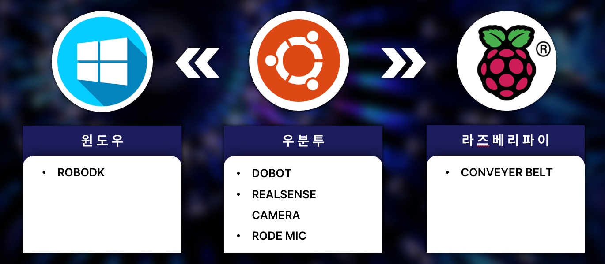
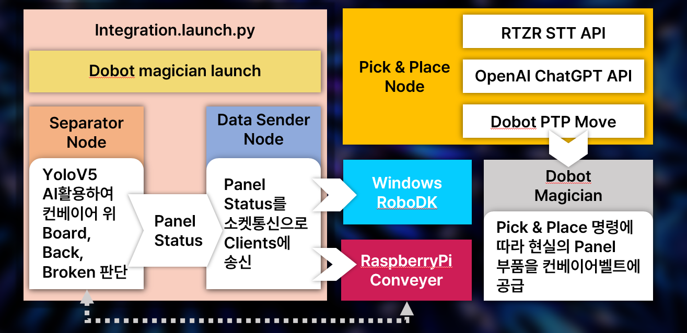
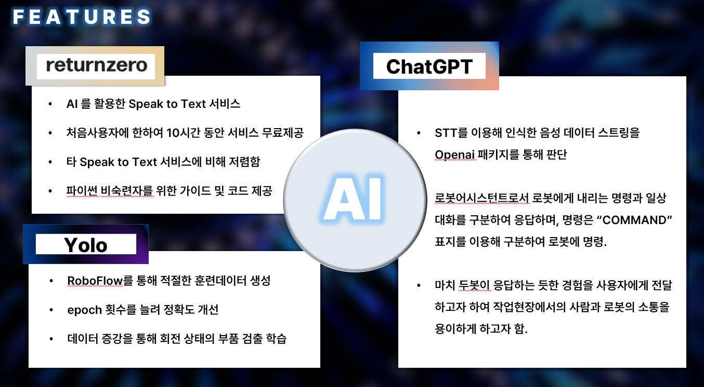
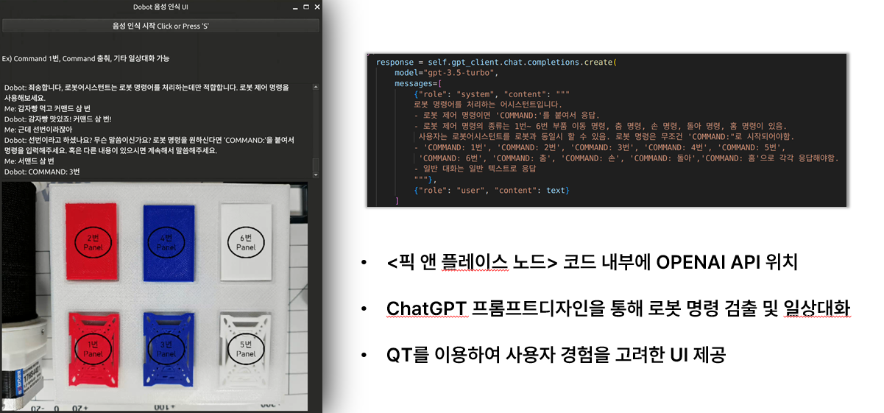
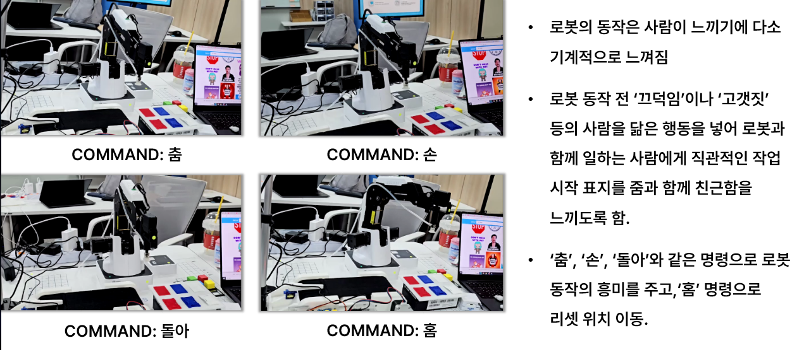
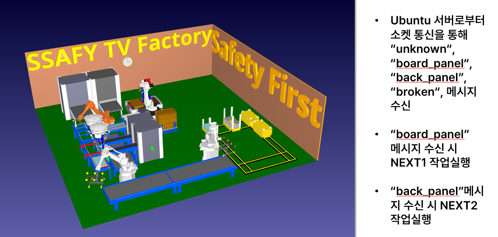

# Dobot-PJT: AI 기반 음성 제어 로봇 프로젝트

## 📌 프로젝트 개요
본 프로젝트는 **Dobot 로봇 팔**과 **GPT 기반 음성 인식 시스템**을 결합하여 인간-로봇 상호작용을 강화하는 것을 목표로 합니다. **ROS2**, **RealSense 카메라**, **YOLOv5**를 활용하여 **객체 감지, 분류 및 Pick & Place 작업**을 수행합니다. 또한, **STT & OpenAI ChatGPT API**를 사용하여 사용자의 음성 명령을 이해하고 실행합니다.

## 🚀 주요 기능
- **AI 기반 객체 감지**: YOLOv5를 이용하여 객체 감지 및 분류 수행
- **음성 제어 로봇**: OpenAI ChatGPT를 통해 음성 명령을 처리
- **디지털 트윈**: 소켓 통신을 통해 Windows RoboDK 간 상태 동기화
- **자연스러운 로봇 동작**: 고개 끄덕임 등 직관적인 반응 제공
- **컨베이어 벨트 시스템**: AI 분류 결과에 따라 자동 정렬

## 🔗 시스템 아키텍처
### 1️⃣ 장치 연결
- **운영 체제**: Ubuntu (서버), Windows (RoboDK), Raspberry Pi (컨베이어 제어)
- **하드웨어**:
  - Dobot Magician
  - Raspberry PI5
  - Intel RealSense D435i 카메라
  - 컨베이어 벨트
  - Rode 마이크
  
  

### 2️⃣ ROS2 워크플로우
- **Integration.launch.py**: 모든 노드를 초기화하는 런치 파일
- **핵심 ROS2 노드**:
  - **Data Sender Node**: 카메라에서 객체 데이터 전송
  - **Separator Node**: `Board`, `Back`, `Broken` 객체 분류
  - **Pick & Place Node**: 로봇 팔 동작 제어
- **소켓 통신**: Raspberry Pi와 Windows RoboDK 간 패널 상태 전달



### 3️⃣ AI 및 STT
- **YOLOv5 객체 감지**: 컨베이어 위의 객체 감지 및 분류
- **RoboFlow 데이터 학습**: 데이터 증강을 통해 감지 성능 향상
- **STT 음성 인식**: RTZR STT API를 사용해 음성을 텍스트로 변환
- **ChatGPT 처리**: 일상 대화와 로봇 명령을 구분
- **자연스러운 로봇 응답**: `COMMAND` 실행 (`춤`, `돌아`, `홈` 등)
- 




### 4️⃣디저털 트윈
- RoboDK 활용하여 디지털 트윈 구현
- Raspberry PI5와 소켓통신하여 현재 작업 상태를 반영

  
## 🛠️ 실행 방법

### ROS2 노드 실행
```bash
source /opt/ros/humble/setup.bash
colcon build
ros2 launch pjt_server integration.launch.py
```

### 음성 제어 시작
```bash
python3 voice_control.py
```

### 동작 영상
[유투브 링크 시연 영상](https://youtu.be/IU831hxLje0)

## 🎯 향후 개선 사항
- **객체 감지 속도 개선**
- **다국어 음성 명령 지원 추가**
- **실시간 오류 처리 기능 추가**

## 🤝 Team
- **황치운**
- **김성훈**

